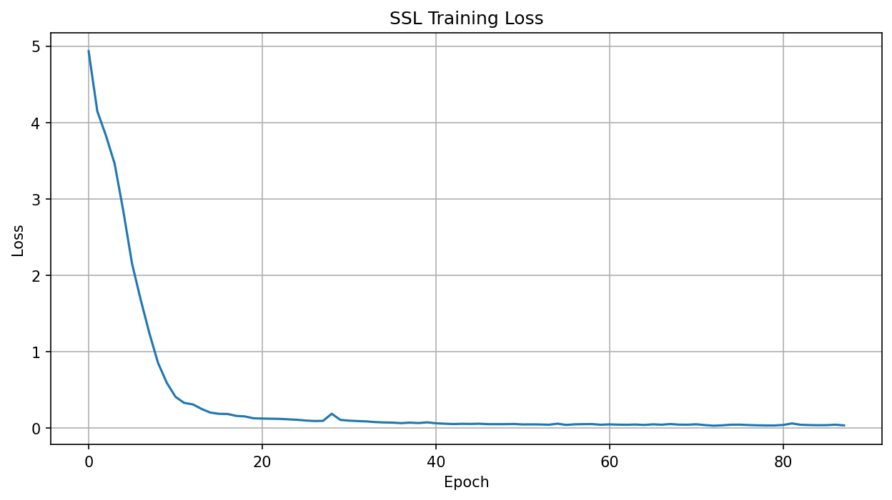
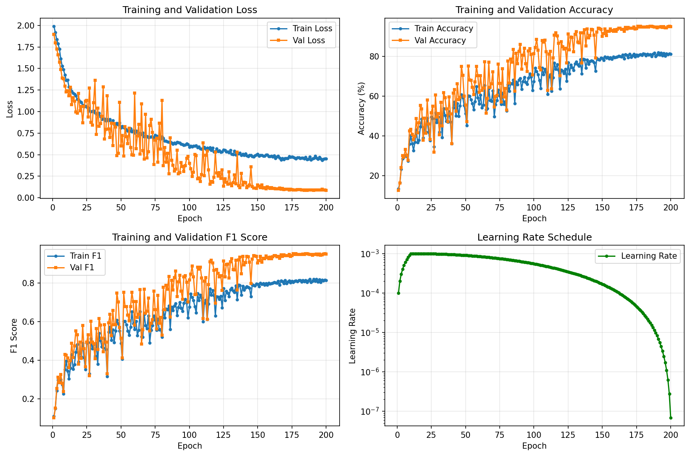

# Crop Variety Classification Using Hyperspectral Imaging and Self-Supervised Learning

A two-stage deep learning pipeline for classifying crop types from hyperspectral
imagery: **SimCLR self-supervised pre-training** on unlabeled pixels, followed
by **supervised fine-tuning** on 7 agricultural classes, using a CNN encoder
with a spectral attention mechanism. Evaluated on the Indian Pines benchmark
dataset.

**Test accuracy: 96.07% | Macro-average precision: 96.48%** across 7 crop classes.

Full write-up: [`report/REPORT.pdf`](report/REPORT.pdf)

## Results

| Metric                    | Train  | Validation | Test   |
|---------------------------|--------|------------|--------|
| Loss                      | 0.4448 | 0.0861     | 0.0776 |
| Accuracy                  | 80.08% | 95.07%     | 96.07% |
| F1 (weighted)             | 0.8031 | 0.9509     | 0.9609 |
| Macro-average precision   | –      | –          | 96.48% |

### Per-class test performance

| Class            | Precision | Recall | F1-score | Support |
|------------------|-----------|--------|----------|---------|
| Corn-notill      | 96.73%    | 96.73% | 96.73%   | 214     |
| Corn-mintill     | 95.08%    | 99.15% | 97.07%   | 117     |
| Corn             | 100.00%   | 100.00%| 100.00%  | 35      |
| Soybean-notill   | 87.73%    | 98.62% | 92.86%   | 145     |
| Soybean-mintill  | 99.11%    | 92.27% | 95.57%   | 362     |
| Soybean-clean    | 96.70%    | 98.88% | 97.78%   | 89      |
| Wheat            | 100.00%   | 100.00%| 100.00%  | 31      |

Two classes (Corn, Wheat) reach perfect precision and recall; the model shows
minimal confusion outside of the naturally similar soybean sub-varieties.

| SSL pre-training loss | Supervised training curves |
|---|---|
|  |  |

## Approach

```
Unlabeled pixels ──► SimCLR contrastive pre-training ──► Encoder weights
                                                              │
Labeled pixels (7 classes) ──► Supervised fine-tuning ◄──────┘
                                        │
                                  Trained classifier
```

1. **Self-supervised pre-training (SimCLR).** The encoder learns general
   spectral-spatial representations from pixels *outside* the 7 selected
   classes, using contrastive learning over augmented views (spectral noise,
   band masking, scaling, spatial flips). No labels are used in this stage.
2. **Supervised fine-tuning.** The pre-trained encoder is attached to a
   classification head and fine-tuned on the labeled data, with the encoder
   frozen for the first few epochs, then jointly fine-tuned at a lower
   learning rate.

### Architecture

- CNN encoder (3 conv blocks, ~490K params) with a **spectral attention**
  module (squeeze-and-excitation over spectral bands) after the first block.
- Adaptive average pooling → 256-d feature vector.
- SSL stage: a SimCLR projection head (256 → 512 → 128) on top of the encoder.
- Supervised stage: a classifier head (256 → 128 → 64 → 7) with dropout and
  batch norm.

See [`src/models.py`](src/models.py) for the full implementation.

## Dataset

[Indian Pines](https://www.ehu.eus/ccwintco/index.php/Hyperspectral_Remote_Sensing_Scenes#Indian_Pines),
collected by the AVIRIS sensor over Northwestern Indiana: 145×145 pixels,
200 usable spectral bands (after removing noisy/water-absorption bands), 16
land-cover classes. This project uses 7 agricultural classes (Corn and
Soybean varieties, plus Wheat) and a stratified 70/15/15 train/val/test split.

## Repository structure

```
├── config.py                  # paths, seed, and class configuration
├── data/
│   └── download_data.py       # fetches the Indian Pines .mat files
├── src/
│   ├── models.py               # SpectralAttention, HyperspectralEncoder,
│   │                            HyperspectralClassifier, SimCLRLoss
│   ├── datasets.py              # SSL + supervised datasets, stratified split
│   ├── utils.py                 # seeding, EarlyStopping, plotting
│   ├── train_ssl.py              # Stage 1: SimCLR pre-training
│   └── train_supervised.py       # Stage 2: fine-tuning + evaluation
├── results/
│   ├── models/                  # trained checkpoints (.pth)
│   ├── plots/                   # training curves
│   ├── metrics/                 # JSON/CSV logs, test results
│   └── splits/split_summary.csv # class counts per split
└── report/
    ├── REPORT.pdf                # full written report
```

## Setup

```bash
git clone <this-repo-url>
cd indian-pines-hyperspectral-classification
pip install -r requirements.txt
python data/download_data.py
```

## Training

```bash
# Stage 1: self-supervised pre-training
python -m src.train_ssl

# Stage 2: supervised fine-tuning + test evaluation
python -m src.train_supervised
```

Both scripts read all paths from `config.py`, which can be overridden with
environment variables (`IP_DATA_DIR`, `IP_SAVE_DIR`, etc.) — no hardcoded
paths, so it runs the same locally, on a server, or in a notebook.

Pre-trained checkpoints from the original run are included in
[`results/models/`](results/models/) if you'd rather skip straight to
evaluation.

## Limitations & future work

- Currently limited to 7 of the 16 Indian Pines classes.
- Patch-based (5×5) processing; full-scene or multi-scale approaches could
  add context.
- Pixel-wise (rather than region-wise) stratified splitting on a single scene
  means some spatial correlation between train/test patches is possible,
  which may make the reported metrics slightly optimistic.
- Future directions: all 16 classes, 3D convolutions, transformer-based
  spectral encoders, and cross-dataset validation (Pavia University, Salinas).

## Acknowledgments

Dataset provided by Purdue University and the AVIRIS sensor team. Project
completed for the Machine Learning course, Department of Computer Science,
University of Mohamed Khider Biskra, under the supervision of Prof. Ahmed
Tibermacine.

## Authors

- Aymen Sayah
- Rafik Sedrata

## License

[MIT](LICENSE)
